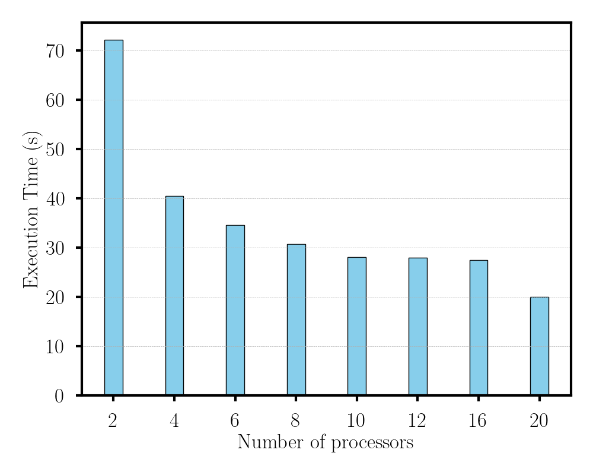
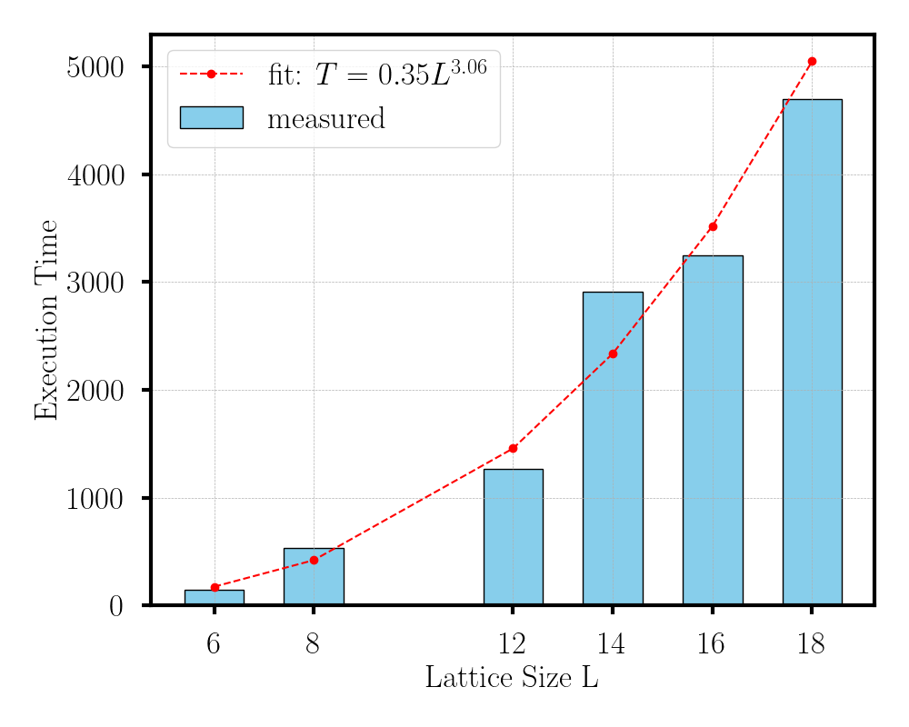

### Sample Code to simulate the fermionic matter coupled to U(1) gauge fields in (2+1)d with the Hamiltonian

<!-- Math equation -->

$$
H_1 = \sum_{\langle x, y \rangle} \Big(
    -t (\psi^\dagger_x S^+_{x,y} \psi_y + \psi^\dagger_y S^-_{x,y} \psi_x)
    + V (n_x - 0.5)(n_y - 0.5)
    + t s^3_{x,y} (n_y - n_x)
\Big)
$$

### Strong Scaling

In strong scaling, the total problem size stays the same as the number of processors increases.  
The example below shows a matrix of size $$N \sim 5 \times 10^6$$
being diagonalized using a Lanczos algorithm for the lowest 300 states.

<figure align="center">
  
  <figcaption>Figure 1: Strong scaling plot for the problem.</figcaption>
</figure>

### Weak Scaling

In weak scaling, the problem size increases at the same rate as the number of processors, keeping the work per processor constant.  
Our benchmarks explore increasing system size while keeping the number of processors fixed. The results show predictable growth in runtime with problem size.

<figure align="center">
  
  <figcaption>Figure 2: Weak scaling plot showing runtime growth with increasing system size.</figcaption>
</figure>

